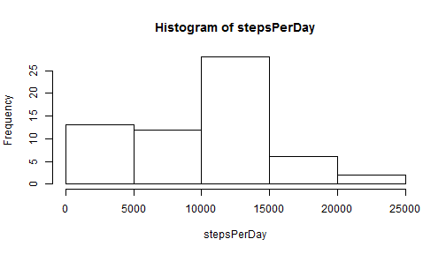

# Reproducible Research: Peer Assessment 1


## Loading and preprocessing the data
        - Load the data (i.e. read.csv())
        
        ```r
                filename<-unzip("./activity.zip")
                activity<-read.csv(filename,as.is=TRUE)
        ```
        
        - Process/transform the data (if necessary) into a format suitable for your analysis
        
        ```r
                activity$date<-as.Date(activity$date,"%Y-%m-%d")
        ```

## What is mean total number of steps taken per day?
        - Make a histogram of the total number of steps taken each day
        
        ```r
                stepsPerDay<-tapply(activity$steps,activity$date,sum)
                barplot(stepsPerDay)
        ```
        
         

    - Calculate and report the mean and median total number of steps taken per day
        
        ```r
                mean(stepsPerDay,na.rm=TRUE)
        ```
        
        ```
        ## [1] 10766
        ```
        
        ```r
                median(stepsPerDay,na.rm=TRUE)
        ```
        
        ```
        ## [1] 10765
        ```


## What is the average daily activity pattern?


## Imputing missing values


## Are there differences in activity patterns between weekdays and weekends?
