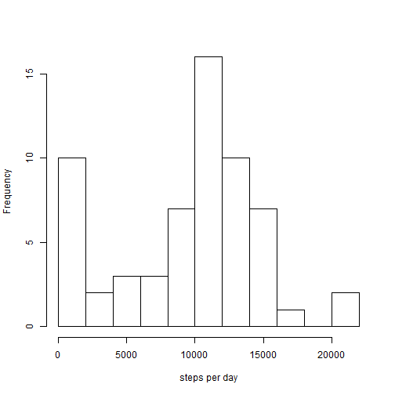

# Reproducible Research: Peer Assessment 1


## Loading and preprocessing the data
- Load the data (i.e. read.csv())

```r
        setwd("c:/users/qs/desktop/coursera/RepData_PeerAssessment1")
        filename<-unzip("activity.zip")
        activity<-read.csv(filename,as.is=TRUE,na.strings="NA")
```
        
- Process/transform the data (if necessary) into a format suitable for your analysis

```r
        activity$date<-as.Date(activity$date,"%Y-%m-%d")
```

## What is mean total number of steps taken per day?
- Make a histogram of the total number of steps taken each days

```r
        stepsPerDay<-tapply(activity$steps,activity$date,sum,na.rm=TRUE)
        hist(stepsPerDay,xlab="steps per day",main="",breaks=10)
```

 

- Calculate and report the mean and median total number of steps taken per day

```r
        mean(stepsPerDay)
```

```
## [1] 9354
```

```r
        median(stepsPerDay)
```

```
## [1] 10395
```

## What is the average daily activity pattern?
- Make a time series plot (i.e. type = "l") of the 5-minute interval (x-axis) and the average number of steps taken, averaged across all days (y-axis)


```r
        intervalSteps<-tapply(activity$steps,activity$interval,mean,na.rm=TRUE)
        plot(as.numeric(names(intervalSteps)),intervalSteps,xlab="interval",ylab="steps per interval",type="l")
```

 

- Which 5-minute interval, on average across all the days in the dataset, contains the maximum number of steps?


```r
        intervalSteps[intervalSteps==max(intervalSteps)]
```

```
##   835 
## 206.2
```


## Imputing missing values

- Calculate and report the total number of missing values in the dataset (i.e. the total number of rows with NAs)

```r
                sum(is.na(activity$steps)) 
```

```
## [1] 2304
```
- Devise a strategy for filling in all of the missing values in the dataset. 

        1.To replace NA, first calculate the mean for this 5-minute interval excluding the NA number.

        2. Replace NA with the mean of this interval.
        
- Create a new dataset that is equal to the original dataset but with the missing data filled in.
        

```r
        intervalmean<-tapply(activity$steps,activity$interval,function(x) mean(x,na.rm=TRUE))
        for (i in 1:length(activity[,1]))
        {
        if (is.na(activity[i,"steps"]))
        activity[i,"steps"]<-intervalmean[as.character(activity[i,"interval"])]
        }
```

- Make a histogram of the total number of steps taken each day and Calculate and report the mean and median total number of steps taken per day.                 

        

```r
        stepsPerDayImpute<-tapply(activity$steps,activity$date,sum)
        hist(stepsPerDayImpute,breaks=10)
```

 

```r
        mean(stepsPerDayImpute)
```

```
## [1] 10766
```

```r
        median(stepsPerDayImpute)
```

```
## [1] 10766
```

```r
        diff<-sum(stepsPerDayImpute)-sum(stepsPerDay)
        diff
```

```
## [1] 86130
```

```r
        diff/sum(stepsPerDay)*100
```

```
## [1] 15.09
```

**Do these values differ from the estimates from the first part of the assignment?**
- Yes, these values differs from the first part.
First,the histogram of imputed data has a distribution closer to normal distribution than the original data with NA removed.
Second, the mean and medium values are identical now. 
        
**What is the impact of imputing missing data on the estimates of the total daily number of steps?**
- Total daily steps increase 86129.51 by imputating the missing data.
This represents a 15% increase of total daily steps.
        

## Are there differences in activity patterns between weekdays and weekends?

- Create a new factor variable in the dataset with two levels - "weekday" and "weekend" indicating whether a given date is a weekday or weekend day.
    

```r
        isWeekDay<-weekdays(activity$date)
        for (i in 1:length(isWeekDay)){
        if ((isWeekDay[i]=="Saturday")|(isWeekDay[i]=="Sunday"))
                activity$weekday[i]<-"weekend"
                else activity$weekday[i]<-"weekday"}
        activity$weekday<-as.factor(activity$weekday)
```

- Make a panel plot containing a time series plot (i.e. type = "l") of the 5-minute interval (x-axis) and the average number of steps taken, averaged across all weekday days or weekend days (y-axis). 
        

```r
        intervalSteps2<-tapply(activity$steps,list(activity$interval,activity$weekday),mean)
        par(mfcol=c(2,1))
        plot(as.numeric(names(intervalSteps)),intervalSteps2[,1],
             type="l",xlab="interval",ylab="steps",main="weekday",
             col="red",ylim=c(1,250))
        plot(as.numeric(names(intervalSteps)),intervalSteps2[,2],
             type="l", xlab="interval",ylab="steps",main="weekend",
             col="blue",ylim=c(1,250))
```

 

**yes, there is difference in activity patterns between weekdays and weekends. Activity is much less during the weekend morning and more during afternoon.**


